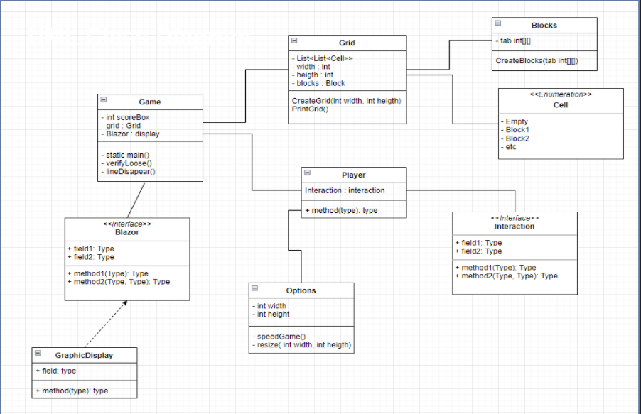
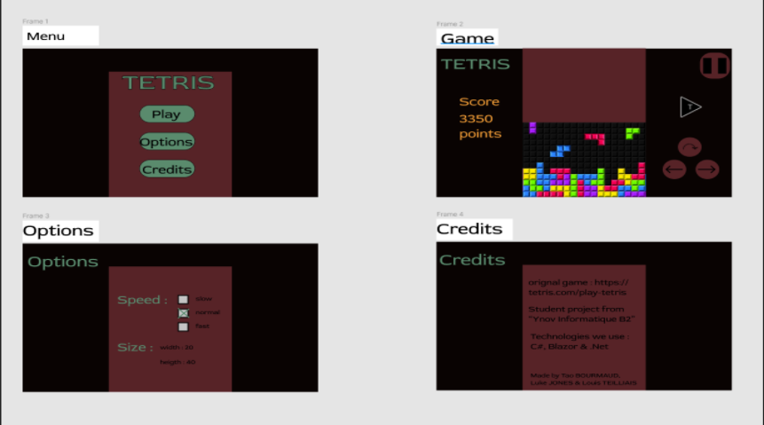
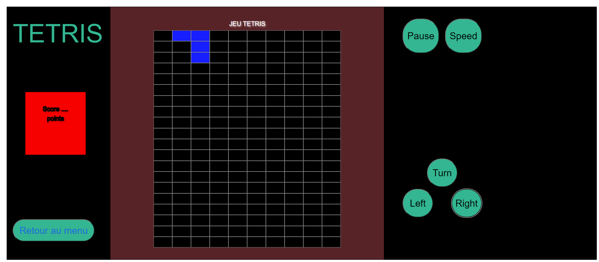

# **TP-Tetris-C-Sharp**

## **Présentation du sujet**
---

Ce projet avait pour but d'implementer le jeu "Tetris" en C# en utilisant le frameWork Blazor. Nous étions 3 dans le groupe: **Luke JONES**, **Louis TEILLIAIS**, **Tao BOURMAUD**.

Tout d'abord, il fallait créer **la page menu** de notre jeu qui contenait :
- le bouton "play" qui redirige vers la page Game.
- le bouton "options" qui redirige vers la page Options.
- le bouton "credits" qui redirige vers la page Creidts.

Ensuite **la page options** qui contenait :
- la vitesse du jeu (lent, normal et rapide)
- la taille de la grille. 

Il y a **la page jeu** qui contient le plus important notre jeu :), nous devions afficher sur cette page :
- la grille 
- un block random en haut de la grille qui peut s'empiler sur d'autre block. 
- Un message GameOver quand le block est aussi haut que la grille
- un bouton rejouer.
- 5 boutons pour les mouvements du block (mouvement gauche, droit, tourner le block, mettre le jeu en pause et le faire tomber plus vite)
- faire disparaitre une ligne quand elle est remplit par les blocks

**La page credits** contenant :
- un lien vers le jeu original Tetris
- une mention disant que c'est bien un project fait par nous même
- les technologies utilisées (Blazor, .Net, c#)
- Nos nom et prénom

---
## **Diagram de class**
---

Pour ce qui est de la preparation nous avons commencer par faire un Diagram de Class sur Draw.Io, elle décrit la structure d'un système en montrant les classes du système, leurs attributs, leurs opérations et les relations entre les objets.
Voici notre schema : 

---
## **Schéma du design de notre jeu**
---

Nous avons aussi fait un schéma du design de notre jeu pour avoir une aperçu a quoi elle pourrait ressembler et pour ensuite l'appliquer. Voici le design : 

---
## **Le code**
---

Pour ce qui est du code pour le moment nous avons donc reussi :
- faire le design du site
- afficher la grille du jeu
- placer un block random sur notre grille. 

Voici à quoi ressemble ce que nous avons accomplie  :

**Le code qui est en cours est :**
- Positionnement des Blocks
- Mouvement des Blocks

**Le code future à faire :**
- Tourner les Blocks							
- Figer les Blocks
- la fonction GameOver() et DeleteLine()					
- Page de Credits
- La difficulté de jeu							
- Modification de la taille de la grille
- affichage du score du jeu									
- mettre le jeu en pause

