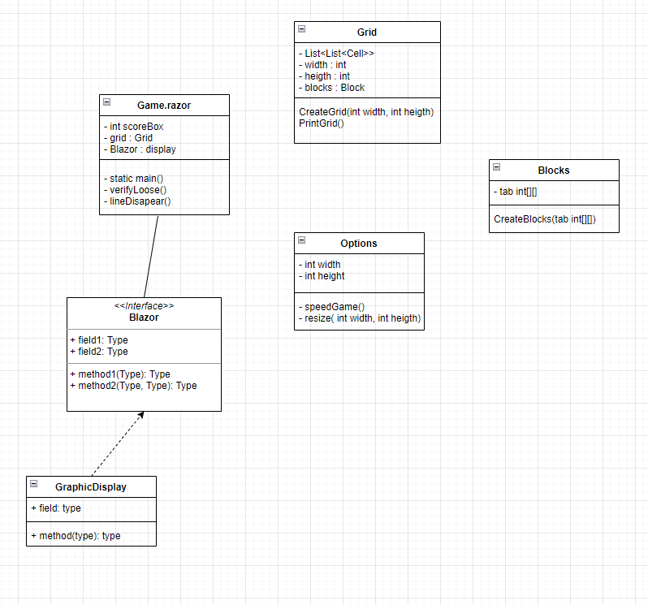

# **TP-Tetris-C-Sharp**

## **Présentation du sujet**
---

Ce projet avait pour but d'implementer le jeu "Tetris" en C# en utilisant le frameWork Blazor. Nous étions 3 dans le groupe: **Luke JONES**, **Louis TEILLIAIS**, **Tao BOURMAUD**.

Tout d'abord, il fallait créer **la page menu** de notre jeu qui contient :
- Le bouton "play" qui redirige vers la page Game.
- Le bouton "options" qui redirige vers la page Options.
- Le bouton "credits" qui redirige vers la page Creidts.

Ensuite **la page options** qui contient :
- La vitesse du jeu (lent, normal et rapide).
- La taille de la grille. 

Il y a **la page jeu** qui contient le plus important notre jeu :), nous devions afficher sur cette page :
- La grille.
- Un block random en haut de la grille qui peut s'empiler sur d'autre block. 
- Un message GameOver quand le block est aussi haut que la grille.
- Un bouton rejouer.
- 5 boutons pour les mouvements du block (mouvement gauche, droit, tourner le block, et le faire tomber plus vite).
- Un bouton pause.
- Faire disparaitre une ligne quand elle est remplit par les blocks.

**La page credits** contenant :
- Un lien vers le jeu original Tetris.
- Une mention disant que c'est bien un project fait par nous même.
- Les technologies utilisées (Blazor, .Net, c#).
- Nos noms et prénoms.

---
## **Diagram de class**
---

Pour ce qui est de la préparation nous avons commencé par faire un Diagram de Class sur Draw.Io, elle décrit la structure d'un système en montrant les classes du système, leurs attributs, leurs opérations et les relations entre les objets.
Voici notre schema au début de projet : 

****

Schéma final avec notre avancé dans le projet : 

---
## **Schéma du design de notre jeu**
---

Nous avons aussi fait un schéma du design de notre jeu pour avoir un aperçu de ce à quoi il pourrait ressembler et pour ensuite l'appliquer. Voici le design : 

---
## **Le code**
---

Pour ce qui est du code,, nous avons réussi à :

- Afficher la grille du jeu.
- Placer un block random sur notre grille. 
- Faire descendre les blocks avec un timer.
- Les bloquer à gauche et à droite de la grille.

Voici à quoi ressemble ce que nous avons accompli :

**Fonctionnalités que l'on a réussi entre la soutenance et le rendu**
- Positionnement des Blocks.
- Mouvement des Blocks.

**Fonctionnalités à déveloper :**
- Tourner les Blocks.							
- Figer les Blocks.
- La fonction GameOver() et DeleteLine().					
- Page de Credits.
- La difficulté de jeu.							
- Modification de la taille de la grille.
- Affichage du score du jeu.									
- Mettre le jeu en pause.
